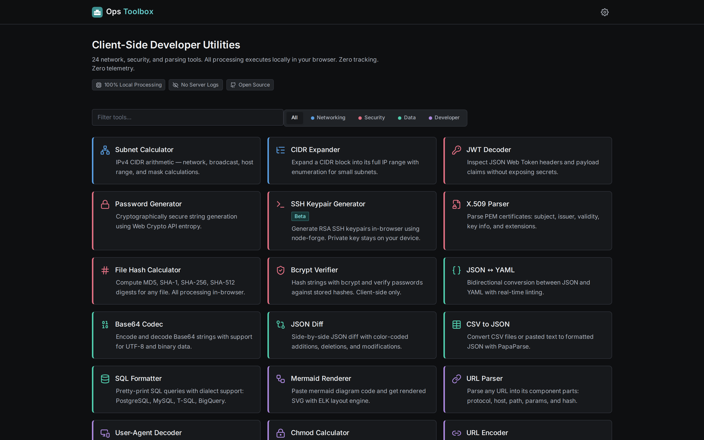

<!--
---
title: "Ops Toolbox"
description: "24 client-side utility tools for IT operations and platform engineering — 100% in-browser, air-gap-friendly, self-hostable."
author: "VintageDon (https://github.com/vintagedon/)"
date: "2026-06-25"
version: "4.0"
status: "Active"
tags:
  - type: project-root
  - domain: utilities
  - tech: [react, vite, tailwind, vitest, docker, nginx]
---
-->

<div align="center">
  
  <h1>Ops Toolbox</h1>
  <p><strong>24 client-side developer utilities for IT operations and platform engineering.</strong></p>
  <p>Paste your data, get your output, keep your privacy. Everything runs in the browser — no servers, no APIs, no data transmission.</p>

  <p>
    <a href="https://react.dev"></a>
    <a href="https://vitejs.dev"></a>
    <a href="https://tailwindcss.com"></a>
    <a href="https://vitest.dev"></a>
    
    
    <a href="LICENSE"></a>
  </p>

  <p>
    <a href="#-live">Live</a> ·
    <a href="#-key-features">Features</a> ·
    <a href="#-tools">Tools</a> ·
    <a href="#-run-locally">Run Locally</a> ·
    <a href="#-self-host-docker">Self-Host</a> ·
    <a href="#-architecture">Architecture</a> ·
    <a href="#-security-model">Security</a> ·
    <a href="https://github.com/radioastronomyio/ops-toolbox">GitHub</a>
  </p>

  
</div>

---

## 🌐 Live

**[opstoolbox.dev](https://opstoolbox.dev/)** — hosted on Azure Static Web Apps.

Or run it yourself: locally for development, or in your own perimeter via the [Docker image](#-self-host-docker).

---

## ❓ Why This Exists

IT professionals reach for web utilities dozens of times a day: subnet math, JWT inspection, diagram rendering, password generation. The catch? Pasting customer network topologies, security tokens, or internal configurations into a third-party website creates compliance and data-sovereignty risk.

Ops Toolbox solves this by being **unconditionally client-side**. There is no code path that transmits input or output anywhere — the toolkit runs identically on a laptop, in a restricted enclave, or on a machine with **no network connection at all**. Verify it yourself in the DevTools Network tab: zero outbound requests during operation.

- **Runs 100% client-side** — zero data leaves the browser.
- **Deploy anywhere** — Azure Static Web Apps, any static host, `localhost`, or an air-gapped Docker instance.
- **Does one thing well** — focused utilities, not a bloated platform.

---

## ✨ Key Features

| Feature | Detail |
|---------|--------|
| **24 focused tools** | Networking, security, data, and developer utilities — see the [Tools](#-tools) table. |
| **Air-gap friendly** | No external calls at runtime; runs on a disconnected host with identical behavior. |
| **Privacy by construction** | No backend, no API, no analytics, no telemetry, no third-party scripts. |
| **Accessible by default** | `data-theme` theming (Light, Dark, High-Contrast Slate, System), visible focus rings, `prefers-reduced-motion` support. |
| **Testable architecture** | Pure logic extracted into `src/lib/`; 474 passing tests across 56 files (Vitest + Testing Library). |
| **Code-split per tool** | Each tool is lazy-loaded with `React.lazy()` + `Suspense` — you only load what you open. |
| **Self-hostable** | A multi-stage Docker image serves the prerendered SPA from nginx; `docker compose up` yields a working instance. |

---

## 🧰 Tools

All 24 tools process data **locally, in the browser** — every tool is air-gap-capable.

### Networking (2)

| Tool | Description | Mode |
|------|-------------|------|
| Subnet Calculator | IPv4 CIDR arithmetic: network, broadcast, host range, mask, interactive tree splitting | Local |
| CIDR Expander | Expand a CIDR block into its full IP range with enumeration | Local |

### Security (6)

| Tool | Description | Mode |
|------|-------------|------|
| JWT Decoder | Inspect JWT headers and payload claims without exposing secrets | Local |
| Password Generator | Cryptographically secure passwords and passphrases (Web Crypto API, rejection sampling) | Local |
| SSH Keypair Generator | Generate RSA SSH keypairs in-browser using node-forge | Local |
| X.509 Parser | Parse PEM certificates: subject, issuer, validity, key info, extensions | Local |
| File Hash Calculator | Compute MD5, SHA-1, SHA-256, SHA-512 digests for any file | Local |
| Bcrypt Verifier | Hash strings with bcrypt and verify passwords against stored hashes | Local |

### Data (5)

| Tool | Description | Mode |
|------|-------------|------|
| JSON ↔ YAML | Bidirectional conversion with real-time linting | Local |
| Base64 Codec | Encode and decode Base64 with UTF-8 and binary support | Local |
| JSON Diff | Side-by-side structural diff with color-coded changes | Local |
| CSV to JSON | Convert CSV files/text to JSON with delimiter auto-detection | Local |
| SQL Formatter | Pretty-print SQL with dialect support (PostgreSQL, MySQL, T-SQL, BigQuery) | Local |

### Developer (11)

| Tool | Description | Mode |
|------|-------------|------|
| Mermaid Renderer | Render mermaid diagrams with the ELK layout engine for superior network topologies | Local |
| URL Parser | Inspect URL components: protocol, host, path, query params, hash | Local |
| User-Agent Decoder | Parse UA strings into browser, OS, device, and engine components | Local |
| Chmod Calculator | Bidirectional Unix permission converter: octal ↔ symbolic ↔ checkboxes | Local |
| URL Encoder | Encode/decode URL components, parse URLs, build query strings | Local |
| Cron Parser | Translate cron expressions to human descriptions, preview next run times | Local |
| Regex Tester | Test patterns with live match highlighting and capture group display | Local |
| ASCII Banner | Generate terminal-style ASCII art banners with figlet fonts | Local |
| UUID Generator | Cryptographically secure UUID v4 and v7 with bulk and format options | Local |
| Unix Epoch | Convert timestamps to human dates and back, with a live counter | Local |
| Markdown Previewer | Live GFM Markdown editor with XSS-safe HTML preview via DOMPurify | Local |

---

## 🚀 Run Locally

```bash
git clone https://github.com/radioastronomyio/ops-toolbox.git
cd ops-toolbox
npm install
npm run dev          # Dev server at http://localhost:5173
```

### Testing

```bash
npm run test         # Single run — 474 tests, 56 files
npm run test:watch   # Watch mode
```

### Production build

```bash
npm run build        # Vite build + per-route prerender + sitemap/llms → dist/
npm run preview      # Preview the production build
```

The build emits `dist/` with one prerendered `index.html` per route (home, every tool, and `/about`), each carrying route-specific `<title>`, Open Graph, Twitter, and canonical meta canonical to `opstoolbox.dev`. It also writes `dist/sitemap.xml` (one `<url>` per route) and `dist/llms.txt` (an LLM-agent index derived from the tool registry), and serves `robots.txt` with the sitemap pointer — all keyed to `https://opstoolbox.dev`.

---

## 🐳 Self-Host (Docker)

The repo ships a multi-stage Docker image that builds the SPA and serves the prerendered site from nginx. The runtime container **makes no external network calls**, so it runs in a disconnected enclave — the air-gap claim is literally true inside the container.

```bash
docker compose up --build      # Build and serve on http://localhost:8080
```

Or build and run the image directly:

```bash
docker build -t ops-toolbox .
docker run -p 8080:80 ops-toolbox
```

To change the host port, edit `ports:` in [`docker-compose.yml`](docker-compose.yml). The nginx config (`docker/nginx.conf`) serves each route's prerendered HTML when present and falls back to the SPA shell for unknown paths, mirroring `staticwebapp.config.json` — so deep links like `/subnet-calculator` unfurl with their own meta and client-side routing still works. `sitemap.xml`, `llms.txt`, and `robots.txt` are served as themselves (not the SPA shell) on both Azure and the self-host image.

You can also deploy the `dist/` directory to any static host (Azure Static Web Apps, Netlify, Vercel, GitHub Pages, an S3 bucket) or serve it from any web server.

---

## 🏗 Architecture

Ops Toolbox is a React 18 SPA with code-split tool routes. Pure computation lives in `src/lib/` (testable without React), UI components in `src/tools/`, and shared primitives in `src/components/` and `src/hooks/`.

```
                    ┌─────────────┐
                    │  index.html │
                    │  + main.jsx │
                    └──────┬──────┘
                           │
                    ┌──────▼──────┐
                    │   App.jsx   │  React Router v6
                    │  (router)   │  lazy-loaded routes
                    └──────┬──────┘
                           │
              ┌────────────┼────────────┐
              │            │            │
       ┌──────▼──────┐ ┌──▼───┐ ┌──────▼──────┐
       │ ToolLayout   │ │ 404  │ │ Directory   │
       │ (nav/footer) │ │      │ │ Grid (home) │
       └──────┬──────┘ └──────┘ └─────────────┘
              │
    ┌─────────┼─────────┐
    │         │         │
┌───▼───┐ ┌──▼──┐ ┌───▼───┐
│Tool 1 │ │ ... │ │Tool 24│  React.lazy() per tool
└───┬───┘ └──┬──┘ └───┬───┘
    │        │        │
    └────────┼────────┘
             │
      ┌──────▼──────┐
      │   src/lib/   │  Pure functions (no React)
      │  (business   │  Tested with Vitest
      │   logic)     │
      └─────────────┘
```

### Key Architectural Decisions

| Decision | Implementation | Rationale |
|----------|---------------|-----------|
| Tool Registry | `src/lib/toolRegistry.js`, data-only module, no React imports | Single source of truth for routing, the directory grid, badges, and search |
| Code Splitting | `React.lazy()` + `Suspense` per tool route | Only load the tool the user navigates to |
| Logic Extraction | Pure functions in `src/lib/`, components in `src/tools/` | Testable without rendering; lib tests are fast |
| Shared Primitives | `useClipboard`, `useDebouncedValue`, `CopyButton`, `ErrorBanner` | Eliminate hand-rolled clipboard/debounce across 24 tools |
| Rejection Sampling | `src/lib/password.js` | Eliminate modulo bias in cryptographic random generation |
| Semantic Design Tokens | HSL CSS custom properties; raw Tailwind palette disabled | Consistent theming across Light / Dark / High-Contrast Slate / System |
| Per-Route Prerender | `scripts/prerender.mjs` | Route-specific title + social cards for SEO and link unfurls, no server needed |

---

## 🔒 Security Model

**Data handling:** All processing happens in your browser. There are no outbound requests during operation — open the DevTools Network tab and confirm it for yourself. The privacy claim is **unconditional**: every tool runs locally, there is no network-dependent code path, and the toolkit behaves identically with no network connection at all. Typography is covered too — Inter and JetBrains Mono are bundled via `@fontsource-variable`, so there is no external font CDN to leak the visit.

**Trust model:** You control the hosting. No analytics, no telemetry, no third-party scripts. The Docker image makes no external calls at runtime, so it runs in a fully air-gapped environment. Read the source, audit it, and run it behind your own perimeter.

**Cryptography:** Password generation uses the Web Crypto API with rejection sampling to eliminate modulo bias. SSH key generation uses node-forge's RSA implementation. UUID generation is cryptographically secure. No secrets are transmitted or stored.

---

## 📄 License

This project is licensed under the MIT License. See [LICENSE](LICENSE) for details.

---

## 🙏 Credits

Built by [VintageDon](https://github.com/vintagedon/). The live site is at [opstoolbox.dev](https://opstoolbox.dev/).

Built on the open-source work of:

- [Mermaid.js](https://mermaid.js.org/) + [ELK.js](https://github.com/kieler/elkjs) — diagram rendering with superior layout
- [PapaParse](https://www.papaparse.com/) — CSV parsing
- [DOMPurify](https://github.com/cure53/DOMPurify) + [marked](https://marked.js.org/) — safe Markdown rendering
- [node-forge](https://github.com/digitalbazaar/forge) — SSH key generation
- [pkijs](https://github.com/PeculiarVentures/PKI.js) + [asn1js](https://github.com/PeculiarVentures/ASN1.js) — X.509 certificate parsing
- [sql-formatter](https://github.com/sql-formatter-org/sql-formatter), [cronstrue](https://github.com/bradymholt/cronstrue), [ua-parser-js](https://github.com/faisalman/ua-parser-js), [bcryptjs](https://github.com/dcodeIO/bcrypt.js)

---

<div align="center">

Part of the [donaldfountain.ai](https://donaldfountain.ai) network.

</div>

---

Last Updated: 2026-06-25 · v4.0 — Open-source readiness (markdownify README, self-host Docker image, OG social card)
