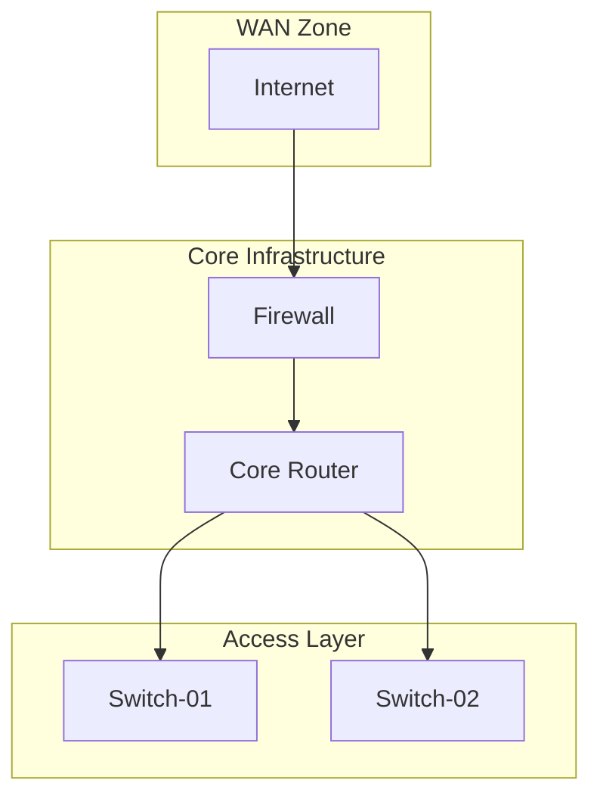

<!--
---
title: "Mermaid Renderer"
description: "Self-hosted diagram rendering with ELK layout engine"
author: "vintagedon"
date: "2025-01-21"
version: "0.1"
status: "Draft"
tags:
  - type: guide
  - category: web-application-servers
  - tech: react/mermaid/elk
  - audience: all
related_documents:
  - "[App Source](../../apps/mermaid-renderer/)"
  - "[Memory Bank](../../.kilocode/rules/memory-bank/README.md)"
---
-->

# Mermaid Renderer

A self-hosted mermaid diagram renderer optimized for network topology diagrams. Runs entirely client-side with zero external network calls, addressing data sovereignty concerns when documenting sensitive infrastructure.

---

## 1. Purpose

Network engineers frequently need to create and share topology diagrams. Mermaid syntax is well-supported by LLMs and documentation tools, making it an efficient way to describe network architectures. However, pasting sensitive network information into external services like mermaid.live creates security concerns.

This renderer provides the same quality output — specifically the clean hierarchical layouts from the ELK engine — while keeping all data local to infrastructure you control.

---

## 2. Scope

What's covered:

- Flowchart diagrams with hierarchical layout
- Live preview with real-time rendering
- Export to SVG and PNG formats
- Dark and light theme support

What's not covered:

- Other mermaid diagram types (sequence, gantt, etc.) — they render but aren't optimized
- Syntax validation feedback beyond error messages
- Saving or sharing diagrams
- Collaboration features

---

## 3. Audience

Anyone who creates network documentation using mermaid syntax. No technical background required for basic use. Understanding of mermaid flowchart syntax assumed.

---

## 4. Features

### Live Preview

The editor provides real-time rendering as you type. Changes are debounced (300ms delay) to prevent layout thrashing during active editing.

### ELK Layout Engine

The renderer uses the ELK (Eclipse Layout Kernel) algorithm via `@mermaid-js/layout-elk`. This produces:

- Clean vertical hierarchy (top-to-bottom flow)
- Proper subgraph containment
- Orthogonal edge routing (right-angle connections)
- Edge merging where multiple connections share paths

This matches mermaid.live's "automatic" mode quality, which is dramatically better than the default Dagre layout for network topologies.

### Export Options

| Format | Method | Notes |
|--------|--------|-------|
| Copy SVG | Clipboard | For pasting into other applications |
| Download SVG | File | Vector format, scales infinitely |
| Download PNG | File | 2x resolution, theme-aware background |

### Theme Support

Dark mode is the default. Light mode toggle available in the header. The exported PNG includes the appropriate background color for the active theme.

---

## 5. Usage

### Basic Workflow

1. Open the renderer in your browser
2. Paste or type mermaid flowchart syntax in the editor (left pane)
3. Preview updates automatically (right pane)
4. Export using the buttons in the header

### Example Diagram

This produces a clean vertical hierarchy with the WAN zone at top, core infrastructure in the middle, and access layer at the bottom.

---

## 6. Technical Notes

### Dependencies

| Package | Version | Purpose |
|---------|---------|---------|
| mermaid | 11.x | Diagram parsing and rendering |
| @mermaid-js/layout-elk | 0.1.x | ELK layout algorithm |
| React | 18.x | UI framework |
| Vite | 5.x | Build tooling |

### Browser Requirements

Modern browsers only:
- Chrome 90+
- Firefox 90+
- Edge 90+
- Safari 14+

### Data Sovereignty

The renderer makes zero network requests during operation. Verify this yourself:

1. Open browser DevTools → Network tab
2. Clear the network log
3. Use the app (edit, change themes, export)
4. Confirm no requests appear

The only network activity is the initial page load.

---

## 7. Limitations

### Current Constraints

| Limitation | Notes |
|------------|-------|
| Subgraph labels | Render inside boxes; external positioning not yet supported |
| Diagram types | Optimized for flowcharts; other types use default layout |
| Mobile | Functional but not optimized; desktop-first design |

### Planned Enhancements

- Subgraph label positioning options
- Additional ELK configuration exposed in UI
- Syntax highlighting in editor

---

## 8. References

| Resource | Description |
|----------|-------------|
| [Mermaid.js Documentation](https://mermaid.js.org/) | Official mermaid syntax reference |
| [ELK.js](https://github.com/kieler/elkjs) | Eclipse Layout Kernel for JavaScript |
| [@mermaid-js/layout-elk](https://www.npmjs.com/package/@mermaid-js/layout-elk) | ELK integration package |
| [Flowchart Syntax](https://mermaid.js.org/syntax/flowchart.html) | Mermaid flowchart reference |

---

## 9. Document Info

| | |
|---|---|
| Author | vintagedon |
| Created | 2025-01-21 |
| Updated | 2025-01-21 |
| Version | 0.1 (Draft) |

---
