# SPA Refactor Architecture Plan

## Overview

Transform ops-toolbox from a monorepo of standalone apps into a single React SPA with React Router, Tailwind CSS, and 6 tool routes (5 new tools + 1 ported existing app).

## Architecture Diagram

```mermaid
graph TB
    subgraph "User Browser"
        A[User] -->|Navigate| B[Ops Toolbox SPA]
    end

    subgraph "SPA Structure"
        B --> C[index.html]
        C --> D[main.jsx]
        D --> E[App.jsx]

        E --> F[BrowserRouter]
        F --> G[ToolLayout]

        G --> H[DirectoryGrid]
        G --> I1[SubnetCalculator]
        G --> I2[JwtDecoder]
        G --> I3[PasswordGenerator]
        G --> I4[JsonYamlConverter]
        G --> I5[Base64Codec]
        G --> I6[MermaidRenderer]

        H --> J[Home Page - Tool Cards]
        J --> K1[Networking]
        J --> K2[Security]
        J --> K3[Data]
        J --> K4[Developer]
    end

    subgraph "Tool Categories"
        K1 --> L1[Subnet Calculator]
        K2 --> L2[JWT Decoder]
        K2 --> L3[Password Generator]
        K3 --> L4[JSON/YAML Converter]
        K3 --> L5[Base64 Codec]
        K4 --> L6[Mermaid Renderer]
    end

    subgraph "Core Components"
        E --> M[toolsConfig Array]
        M --> N[Single Source of Truth]
        N --> O[Tool Registry]
        O --> P[Lazy Loading]
        P --> Q[React.lazy + Suspense]
    end

    subgraph "Styling"
        E --> R[Tailwind CSS v3]
        R --> S[Dark Mode Default]
        S --> T[Slate Palette]
        T --> U[Sky Accent]
    end

    subgraph "Data Flow"
        V[User Input] --> W[Tool Component]
        W --> X[Computation]
        X --> Y[Display Output]
        Y --> Z[Client-Side Only]
    end

    style A fill:#38bdf8
    style B fill:#0f172a
    style E fill:#1e293b
    style R fill:#1e293b
    style Z fill:#10b981
```



## Directory Structure

```
ops-toolbox/
├── src/
│   ├── main.jsx                 # React entry point
│   ├── App.jsx                  # Router + lazy route definitions
│   ├── index.css                # Tailwind directives + global styles
│   ├── components/
│   │   ├── ToolLayout.jsx       # Shared shell (header, footer, <Outlet>)
│   │   └── DirectoryGrid.jsx    # Home page tool directory
│   └── tools/
│       ├── SubnetCalculator.jsx
│       ├── JwtDecoder.jsx
│       ├── PasswordGenerator.jsx
│       ├── JsonYamlConverter.jsx
│       ├── Base64Codec.jsx
│       └── mermaid-renderer/
│           ├── MermaidRenderer.jsx
│           ├── Editor.jsx
│           └── config.js
├── index.html                   # SPA entry
├── vite.config.js               # Root-level Vite config
├── tailwind.config.js
├── postcss.config.js
├── package.json                 # Single package (no workspaces)
└── specs/                       # Implementation specs
```

## Key Technical Decisions

### 1. Single SPA Architecture
- **Why**: Simpler deployment, shared routing, consistent UX
- **How**: React Router v6 with lazy-loaded routes
- **Benefit**: One codebase, one build, one deployment

### 2. Tailwind CSS v3
- **Why**: Utility-first, dark mode support, rapid development
- **How**: PostCSS + standard Tailwind setup
- **Benefit**: Consistent styling, small bundle size

### 3. Lazy Loading
- **Why**: Performance optimization, code splitting
- **How**: React.lazy() + Suspense for each tool
- **Benefit**: Only load code for active tool

### 4. Client-Side Only
- **Why**: Privacy, no backend needed
- **How**: All computation in browser
- **Benefit**: Data never leaves user's device

### 5. toolsConfig as Single Source of Truth
- **Why**: Centralized tool registry
- **How**: Array in App.jsx consumed by router and home page
- **Benefit**: Easy to add new tools

## Tool Specifications

| Tool | Route | Category | Dependencies | Key Features |
|------|-------|----------|--------------|--------------|
| Subnet Calculator | /subnet-calculator | Networking | None | IPv4 CIDR arithmetic, bitwise math |
| JWT Decoder | /jwt-decoder | Security | jwt-decode | Token inspection, timestamp display |
| Password Generator | /password-generator | Security | None | Web Crypto API, entropy estimate |
| JSON/YAML Converter | /json-yaml | Data | js-yaml | Bidirectional conversion, error handling |
| Base64 Codec | /base64 | Data | None | UTF-8 support, encode/decode |
| Mermaid Renderer | /mermaid-renderer | Developer | mermaid, codemirror, elk | Diagram rendering, export options |

## Implementation Phases

### Phase 1: SPA Scaffold (Spec 00)
- Set up Vite, React, React Router, Tailwind
- Create routing structure
- Build shared layout components
- Create placeholder tools
- **Verification**: Home page renders, navigation works

### Phase 2: Subnet Calculator (Spec 01)
- Implement CIDR parsing
- Bitwise network calculations
- Error handling
- **Verification**: Correct calculations for test cases

### Phase 3: JWT Decoder (Spec 02)
- Install jwt-decode
- Two-panel layout
- Real-time decoding
- **Verification**: Valid JWT decodes correctly

### Phase 4: Password Generator (Spec 03)
- Web Crypto API integration
- Character pool controls
- Entropy calculation
- **Verification**: Generates secure passwords

### Phase 5: JSON/YAML Converter (Spec 04)
- Install js-yaml
- Bidirectional conversion
- Error handling
- **Verification**: Converts correctly both ways

### Phase 6: Base64 Codec (Spec 05)
- UTF-8 support
- Encode/decode functions
- **Verification**: Round-trip works with special characters

### Phase 7: Mermaid Renderer Port (Spec 06)
- Port existing app
- CSS to Tailwind migration
- ELK layout integration
- **Verification**: All features work, old app deleted

## Validation Criteria

### Browser Testing After Each Phase
- ✅ No console errors
- ✅ Tool renders correctly
- ✅ Navigation works
- ✅ Responsive design
- ✅ Dark mode styling

### Final Verification
- ✅ All 6 tools load without errors
- ✅ Each tool functions per spec
- ✅ No console errors on any route
- ✅ Home directory shows all tools
- ✅ Lazy loading works

## Constraints & Warnings

### Critical Constraints
- **100% client-side**: No API calls, no backends
- **No @cldn/ip package**: Use pure bitwise math for subnet calc
- **Tailwind v3 only**: Not v4
- **Dark mode default**: Light mode optional
- **Privacy-first**: Data never leaves browser

### Warnings
- Do not modify `.github/workflows/` (deployment separate)
- Do not use analytics or telemetry
- Do not add third-party scripts
- CodeMirror CSS overrides go in `src/index.css`

## Branch Strategy

- **Branch**: `feature/spa-refactor`
- **Commits**: After each numbered spec
- **Messages**: Descriptive (e.g., "feat: scaffold SPA with React Router and Tailwind")

## Success Metrics

1. **Build Success**: `npm run dev` starts without errors
2. **Render Success**: All tools render correctly in browser
3. **Functional Success**: Each tool works per its spec
4. **Performance Success**: Lazy loading works, no unnecessary code loaded
5. **UX Success**: Consistent styling, responsive design, intuitive navigation

## Next Steps

1. Review this architecture plan
2. Confirm approach and constraints
3. Switch to Code mode to begin implementation
4. Execute phases sequentially (00 → 01 → 02 → 03 → 04 → 05 → 06)
5. Test after each phase
6. Commit after each phase
7. Final verification and testing
